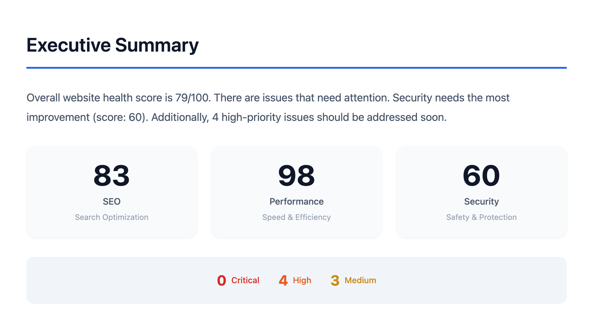
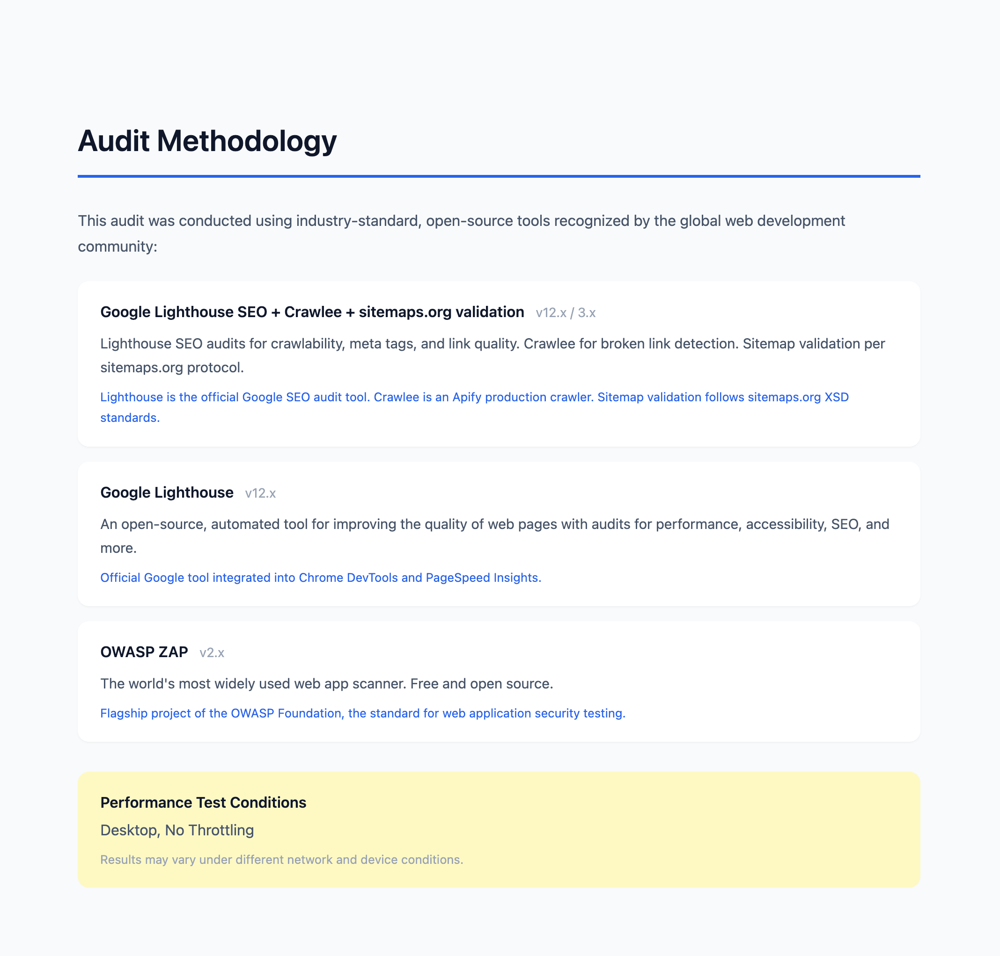
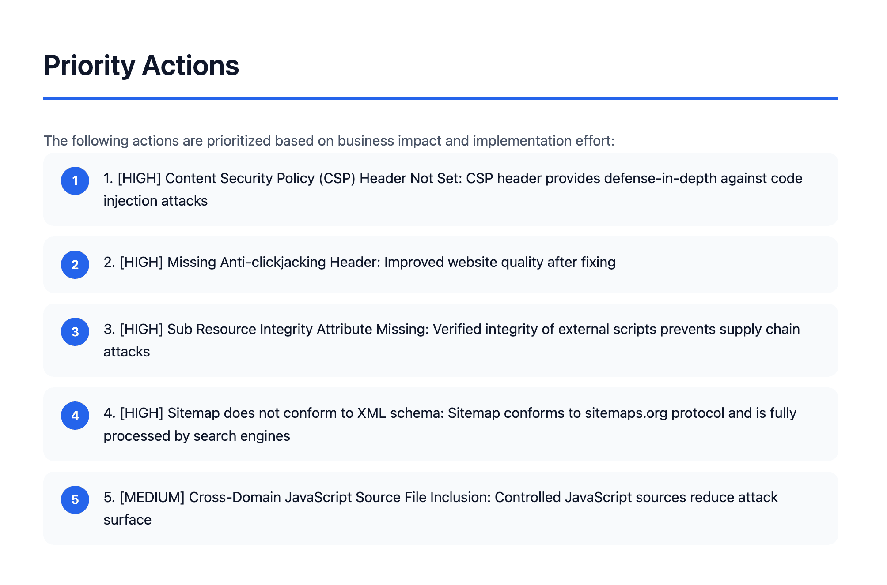
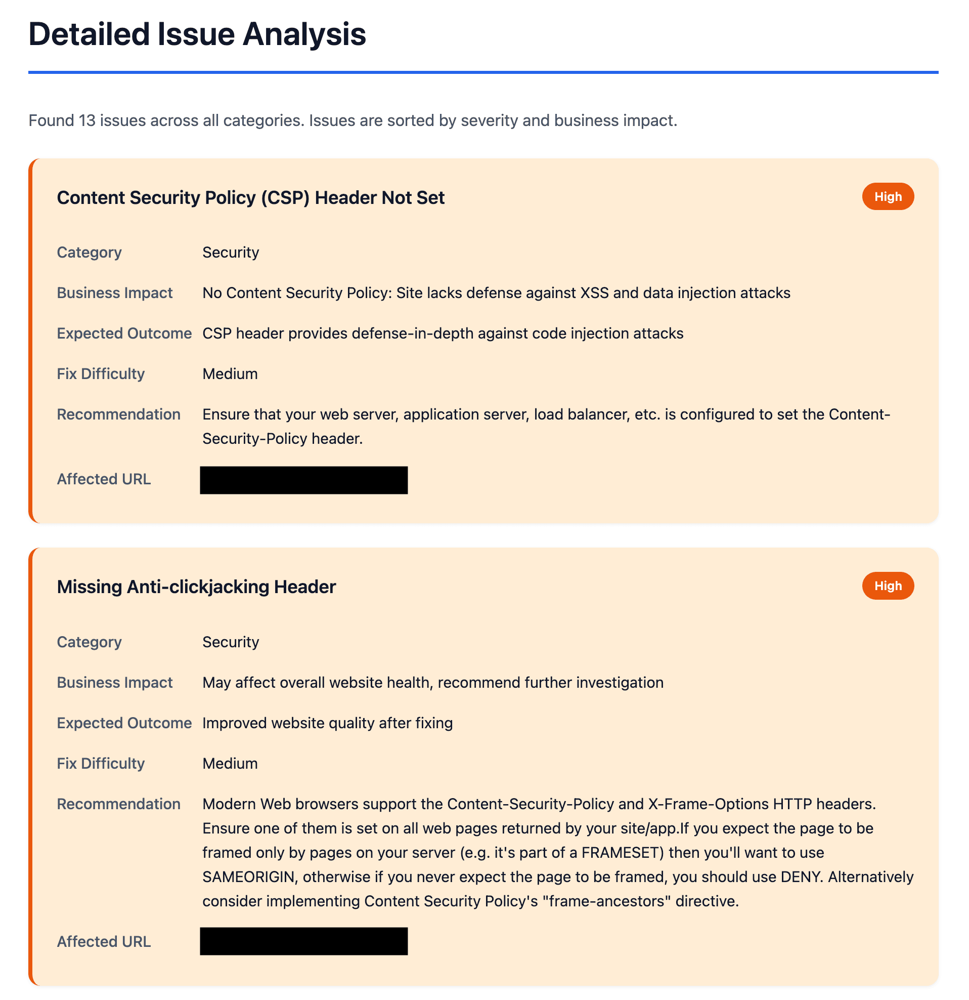

# web-audit-cli

[](https://github.com/liamlin/web-audit-cli/actions/workflows/ci.yml)
[](https://opensource.org/licenses/MIT)
[](https://nodejs.org)
[](https://www.typescriptlang.org/)

A comprehensive CLI tool, web service, and desktop app for website SEO, performance, and security auditing. Combines three audit engines and transforms technical findings into business-focused reports. Available as a command-line tool, browser-based web interface, or desktop app.

## Demo

<p align="center">
  
</p>

<p align="center"><em>Executive Summary with pass/fail checks and severity breakdown</em></p>

<details>
<summary><strong>View more report sections</strong></summary>

<p align="center">
  
</p>

<p align="center"><em>Audit Methodology showing tools and test conditions</em></p>

<p align="center">
  
</p>

<p align="center"><em>Priority Actions ranked by business impact</em></p>

<p align="center">
  
</p>

<p align="center"><em>Detailed Issue Analysis with business impact matrix</em></p>

</details>

## Features

- **SEO Audit**: Uses Google Lighthouse for crawlability, meta tags, canonicals, and robots.txt checks; validates sitemap.xml against sitemaps.org schema; detects broken links via Crawlee
- **Performance Audit**: Uses Lighthouse to analyze Core Web Vitals (LCP, CLS, TBT) with desktop or mobile simulation
- **Security Audit**: Passive security scanner based on Mozilla Observatory and OWASP Secure Headers Project standards (checks HTTP headers, cookies, SRI, and more)
- **Business Reports**: Transforms technical issues into stakeholder-friendly language with impact assessments
- **Multi-language Support**: Reports available in Traditional Chinese (繁體中文) and English
- **Desktop App**: Electron-based desktop app for non-technical users (macOS .dmg, Windows .exe, Linux AppImage)
- **Audit Methodology**: Reports include tool credibility and testing methodology for transparency

## Requirements

- **Node.js v20+** (required - enforced at runtime)
- **Chrome/Chromium** (optional - for SEO and performance auditing via Lighthouse)

### Environment Detection

The CLI automatically checks for dependencies at startup:

- If Node.js version is below 20.0, the CLI exits with an error and installation instructions
- If Chrome is not found, SEO runs without Lighthouse checks and performance module is skipped

Use `--verbose` to see a detailed environment summary before the audit runs.

## Installation

```bash
npm install
npm run build
npm link  # Makes 'web-audit' command available globally
```

## Usage

```bash
# Basic usage - audit all modules
web-audit --url https://example.com

# SEO and performance only
web-audit --url https://example.com --modules seo,performance

# Output in multiple formats
web-audit --url https://example.com --format pdf,json,html

# English report with mobile performance testing
web-audit --url https://example.com --language en --performance-mode mobile-4g

# Enable verbose logging
web-audit --url https://example.com --verbose
```

## CLI Options

| Option                    | Description                               | Default     |
| ------------------------- | ----------------------------------------- | ----------- |
| `-u, --url <url>`         | Target URL to audit (required)            | -           |
| `-o, --output <dir>`      | Output directory for reports              | `./reports` |
| `-m, --modules <list>`    | Modules to run (seo,performance,security) | All modules |
| `-f, --format <list>`     | Output formats (pdf,json,html)            | `html`      |
| `-d, --crawl-depth <n>`   | Max pages to crawl for SEO (1-100)        | `50`        |
| `-t, --timeout <seconds>` | Total timeout (60-3600)                   | `300`       |
| `-p, --performance-mode`  | Performance test mode (desktop/mobile-4g) | `desktop`   |
| `-l, --language <lang>`   | Report language (zh-TW/en)                | `en`        |
| `-v, --verbose`           | Enable detailed logging                   | `false`     |
| `--parallel`              | Run audit modules in parallel             | `false`     |

## Output

Report filenames include the domain for easy identification (e.g., `audit-example-com-1705435200000.html`).

The tool generates reports with:

- **Pass/Fail Summary**: What's working and what needs attention per category
- **Executive Summary**: Business-friendly overview of findings
- **Audit Methodology**: Tools used, their credibility, and test conditions (desktop/mobile)
- **Priority Actions**: Top 5 issues to address
- **Detailed Analysis**: Each issue with business impact, fix difficulty, and expected outcome

The HTML report features a slide-like presentation with keyboard navigation (arrows, space, page up/down).

### Performance Modes

| Mode        | Description                            | Use Case                                   |
| ----------- | -------------------------------------- | ------------------------------------------ |
| `desktop`   | No throttling, real device performance | Matches actual desktop browsing experience |
| `mobile-4g` | Simulated 4G network + CPU throttling  | Tests mobile user experience               |

The test conditions are clearly labeled in reports to ensure transparency when comparing results.

## Web Mode

In addition to the CLI, the tool can run as a web service with a browser-based interface.

### Local Development

```bash
npm run build
npm run start:web
# Open http://localhost:8080
```

### Environment Variables

| Variable | Description | Default |
| -------- | ----------- | ------- |
| `PORT`   | Server port | `8080`  |

### API Endpoints

| Endpoint                  | Method | Description            |
| ------------------------- | ------ | ---------------------- |
| `/api/health`             | GET    | Health check (no auth) |
| `/api/audit`              | POST   | Start audit            |
| `/api/audit/:id/progress` | GET    | SSE progress stream    |
| `/api/audit/:id/result`   | GET    | JSON result            |
| `/api/audit/:id/report`   | GET    | HTML report            |
| `/api/audit/:id/pdf`      | GET    | PDF download           |

## Desktop App

The tool is also available as a native desktop app via Electron, suitable for non-technical users who prefer a GUI.

### Running in Development

```bash
npm run start:electron
```

This builds both the main app and the Electron code, then launches a native window pointed at the web interface.

### Packaging

```bash
npm run pack:mac     # macOS .dmg
npm run pack:win     # Windows .exe installer
npm run pack:linux   # Linux AppImage
```

### Notes

- **Chrome/Chromium required**: The desktop app runs audit engines that call Chrome directly on the host machine.
- **SSRF guard disabled**: In desktop mode, the SSRF guard is intentionally disabled since users scan their own targets.

## Development

```bash
npm run dev             # Watch mode
npm run build           # Build
npm run build:electron  # Build Electron code
npm run test            # Run tests
npm run test:watch      # Watch tests
npm run test:coverage   # Coverage report
npm run start:web       # Start web server
npm run start:electron  # Launch desktop app
```

## Architecture

```
CLI Entry → Orchestrator → [SEO|Performance|Security] Auditors
                ↓
         AuditResult[]
                ↓
         MatrixEngine (adds business context)
                ↓
         BusinessReport
                ↓
         ReportGenerator (PDF/HTML/JSON)
```

## Versioning & Releases

This project uses [Semantic Versioning](https://semver.org/) and [release-please](https://github.com/googleapis/release-please) for automated releases.

### How Releases Work

1. Make changes using [Conventional Commits](https://www.conventionalcommits.org/):
   - `fix: description` → patch release (0.1.0 → 0.1.1)
   - `feat: description` → minor release (0.1.0 → 0.2.0)
   - `feat!: description` or `BREAKING CHANGE:` → major release (0.1.0 → 1.0.0)

2. Push to `main` - release-please automatically creates/updates a Release PR

3. Merge the Release PR to trigger:
   - Version bump in `package.json`
   - `CHANGELOG.md` update
   - Git tag and GitHub Release

### Pre-1.0 Status

While the version is below 1.0.0, the API and CLI interface may change. Breaking changes will bump the minor version instead of major.

## License

MIT
